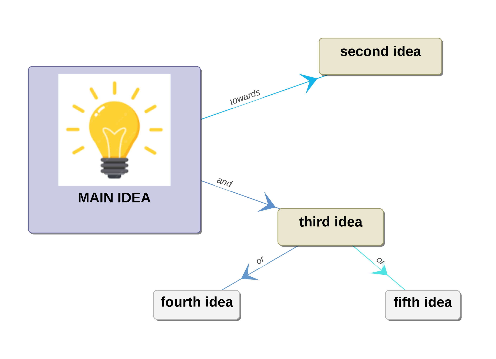

# e4maps

E4Maps is a simple mind mapping software.

This project was developed exclusively using `gemini-cli`, `Qwen3-Coder`, and `Mistral Vibe`.



## Dependencies

This project uses the following dependencies:

- GTKMM 3.0 (for UI)
- CAIROMM (for graphics rendering)
- tinyxml2 (for XML parsing)
- Gettext (for internationalization)
- libintl (for internationalization support)

tinyxml2 is provided 'as-is', without any express or implied warranty. It is free to use for any purpose, including commercial applications, and can be redistributed freely with only a few restrictions:

1. The origin of the software must not be misrepresented
2. Altered source versions must be plainly marked as such
3. The original license notice must not be removed or altered from any source distribution

## Building on Linux

### Install Dependencies

First, install the required dependencies based on your distribution:

#### Ubuntu/Debian:
```bash
sudo apt-get update
sudo apt-get install build-essential cmake pkg-config libgtkmm-3.0-dev libcairomm-1.0-dev gettext
```

#### Fedora/RHEL:
```bash
sudo dnf install gcc gcc-c++ cmake pkgconfig gtkmm30-devel cairomm-devel gettext
```

#### Arch Linux:
```bash
sudo pacman -S base-devel cmake gtkmm3 cairomm gettext
```

### Compile the Project

1. Clone the repository:
```bash
git clone https://github.com/doriansoru/e4maps.git
cd e4maps
```

2. Create a build directory and compile:
```bash
mkdir build && cd build
cmake ..
make
```

3. (Optional) Install the application:
```bash
sudo make install
```

### Running the Application

After compilation, you can run the application from the build directory:
```bash
./e4maps
```

## Building on macOS

### Prerequisites

1. **Xcode Command Line Tools**:
   ```bash
   xcode-select --install
   ```

2. **Homebrew**:
   If not installed, get it from [brew.sh](https://brew.sh/).

### Install Dependencies

```bash
brew install cmake pkg-config gtkmm3 gettext
```

### Compile the Project

1. Clone the repository:
   ```bash
   git clone https://github.com/doriansoru/e4maps.git
   cd e4maps
   ```

2. Create a build directory and compile:
   Note: We need to specify the path to `gettext` as it is keg-only on macOS.

   ```bash
   mkdir build && cd build
   cmake .. -DCMAKE_PREFIX_PATH=$(brew --prefix gettext)
   make
   ```

### Running the Application

```bash
./e4maps
```

## Building on Windows

### Option 1: Using MSYS2 (Recommended)

1. Install [MSYS2](https://www.msys2.org/) and update the package database:
```bash
pacman -Syu
```

2. Install required dependencies:
```bash
pacman -S mingw-w64-x86_64-gcc mingw-w64-x86_64-cmake mingw-w64-x86_64-make mingw-w64-x86_64-gtkmm3 mingw-w64-x86_64-cairomm mingw-w64-x86_64-gettext
```

3. Add the MSYS2 MinGW path to your system PATH, typically:
```
C:\msys64\mingw64\bin
```

4. Clone and compile the project:
```bash
git clone https://github.com/doriansoru/e4maps.git
cd e4maps
mkdir build && cd build
cmake .. -G "MinGW Makefiles"
cmake --build .
```

5. Run the application:
```bash
./e4maps.exe
```

### Option 2: Using Visual Studio with vcpkg

1. Install Visual Studio with C++ development tools
2. Install vcpkg and integrate it with Visual Studio
3. Install required packages:
```cmd
vcpkg install gtkmm3:x64-windows cairomm:x64-windows gettext:x64-windows
```

4. Configure the project with CMake using the vcpkg toolchain file

### Creating Windows Installer

The project includes an NSIS script (`e4maps.nsi`) to create a Windows installer. After compiling the application, you would need to:

1. Ensure the executable and all required DLLs are in a `dist` folder
2. Install [NSIS](https://nsis.sourceforge.io/)
3. Compile the installer script:
```cmd
makensis e4maps.nsi
```

## Internationalization

This project supports multiple languages through the Gettext system:

- To update translations, run: `./update-translations.sh`
- To compile translation files: `./compile-translations.sh` or `make compile-translations` after building with CMake

## Contributing

Feel free to submit issues and enhancement requests via GitHub.
